##### [Главная страница](../README.md)

### Интерфейс командной строки

Основным требованием к любому функуионалу должно быть требование удобства использования. Это означает что:

 1. Все действия должны быть интуитивно понятны;
 2. Работая с функционалом нет нужды обращаться к документации.

Мы постарались сделать наиболее удобным использование модуля как при написании миграции так и при работе с очередью уже готовых миграций.

Основной интерфейс модуля - терминал. При использовании этого подхода есть неоспоримые приимущества:

 1. Время выполнения миграций не ограничено таймаутом сервера;
 2. Возможность автоматизировать обновление миграций совместно с обновлением кода. К примеру, можно интегрировать механизм обновления миграций
  при помощи функционала перехватчиков `СУРВ Git`

#### Начало работ

Файл для работы с миграцими через интерфейс командной строки расположен по пути `bitrix/tools/migrate`, таким образом запускать миграции через командную строку всегда нужно через этот файл.

Пример:

```sh
$ php bitrix/tools/migrate
```

Отображает список доступных действий


Можно получить более подробную информацию по каждому действию набрав ```--help``` после имени действия, к примеру:
```sh
$ php bitrix/tools/migrate create --help
```

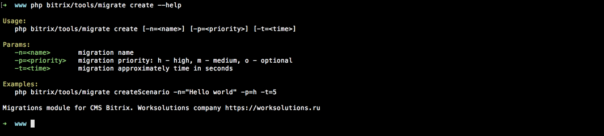
Выводится простая, но в то же время содержательная справка по параметрам действия и их использованию

#### Список миграций доступных для обновления

```sh
$ php bitrix/tools/migrate list
```

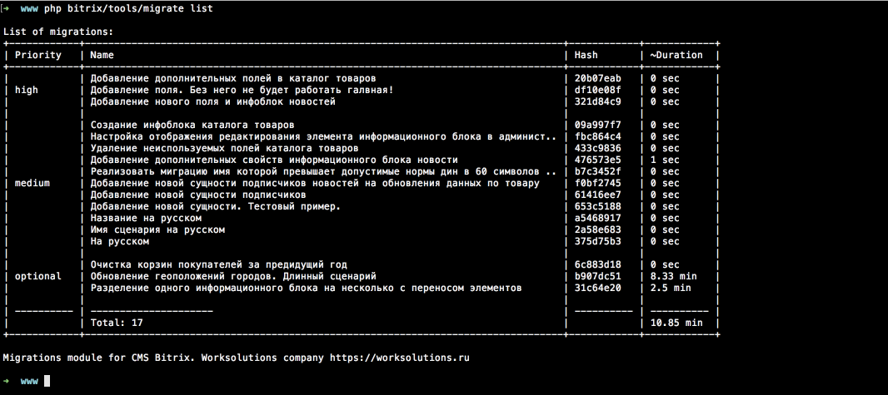

Миграции в списке группируются по приоритету, именно в таком порядке они будут обновляться. Так же выводится  суммарное время обновления согласно пустановленным периодам в сценариях. Это позволяет правильно ориентироваться по времени при обновлении.

#### Создание миграции

Интерактивный способ

```sh
$ php bitrix/tools/migrate create
```

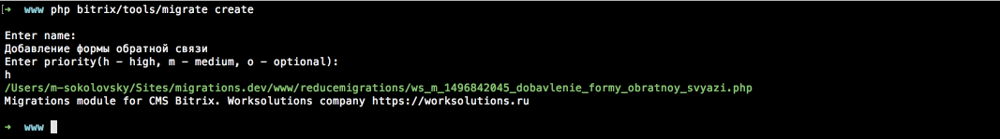

Быстрый способ

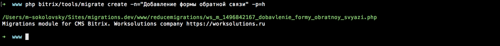

#### Применение подготовленных миграций

Запуск миграции по хешу.

```sh
$ php bitrix/tools/migrate apply a5468917
```

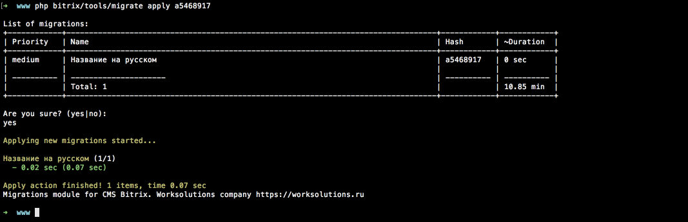

Из списка подготовленных миграций выбирается та, которая соответствует подстроке хеша.

Запуск всех миграций.

```sh
$ php bitrix/tools/migrate apply -f
```

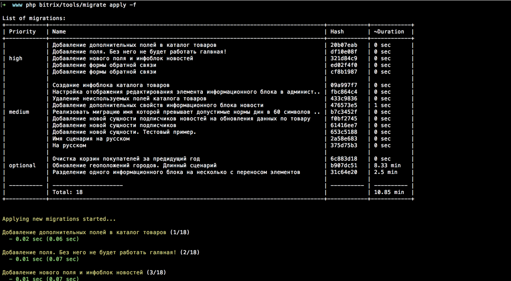

Флаг ```-f``` указывает на то что применение миграций начинать без запроса на подтверждение.

Запуск всех миграций.

```sh
$ php bitrix/tools/migrate apply -f --skip-optional
```


Параметр ```--skip-optional``` указывает на пропуск опциональных миграций. Опциональные миграции создаются в основном для актуализаций боевой площадки и занимают продолжительное время, на площадках разработчиков такая актуализация не требуется и при обновлении миграций на площадке разработчика их можно пропустить.

Подойдет для обработчиков ```git```

#### История применения миграций

Все примененные миграции сохраняются в истории.

Последнее обновление миграций:
```sh
$ php bitrix/tools/migrate history
```

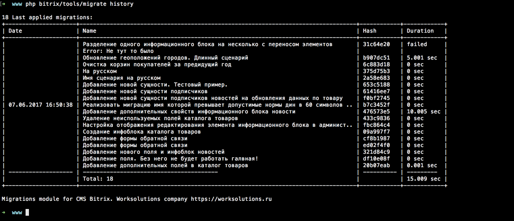

Просмотр истории по количеству последних миграций:
```sh
$ php bitrix/tools/migrate history
```

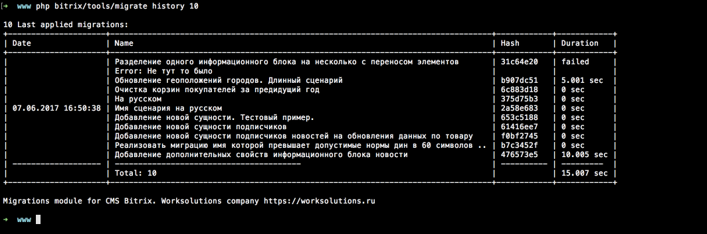

#### Откат миграций

Откат миграций производится через метод класса миграций ```rollback```

Откат последнего обновления:
```sh
$ php bitrix/tools/migrate rollback
```

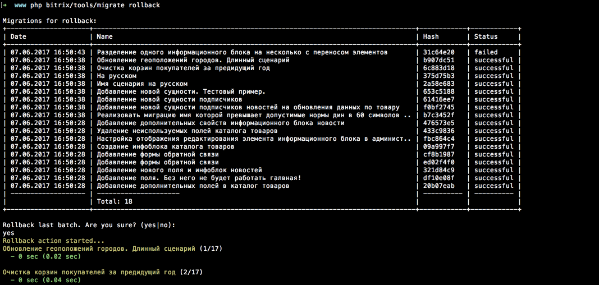

Откат последнего обновления:
```sh
$ php bitrix/tools/migrate rollback
```


Откат одной миграции по хешу:
```sh
$ php bitrix/tools/migrate rollback b907dc51
```

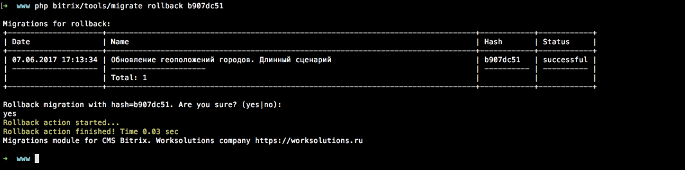

Откат определенного количества последних миграций:
```sh
$ php bitrix/tools/migrate rollback --count=2
```

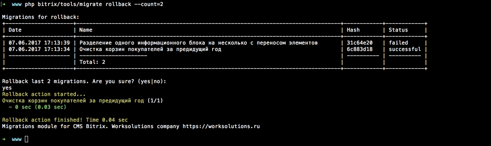

Откат всех свежих миграций вплоть до определенной из списка:
Откат определенного количества последних миграций:
```sh
$ php bitrix/tools/migrate rollback --count=2
```

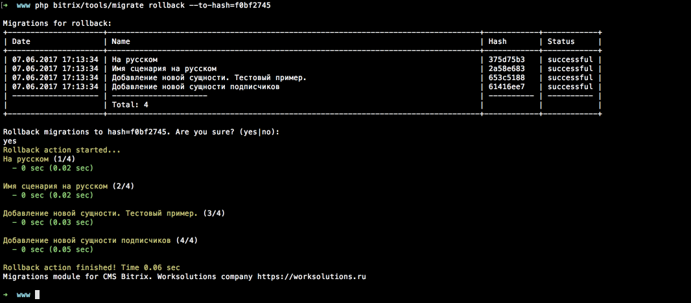

Применение и откат миграций сопровождается списком с перечнем того что будет обновляться или отменяться.
