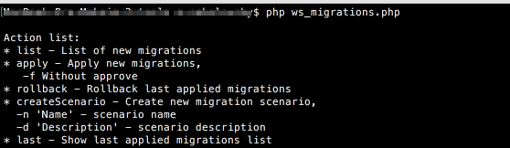
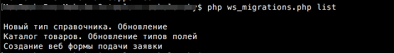
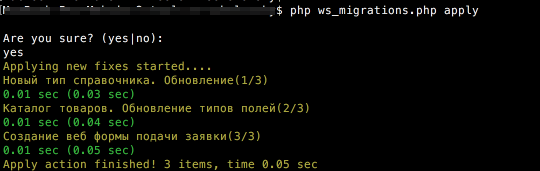
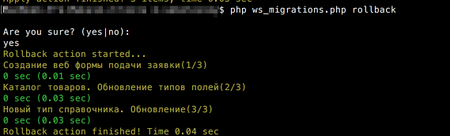

##### [Главная страница](../README.md)

### Интерфейс командной строки

В версии модуля `1.5.0` появилась возможность работать с подготовленными миграциями из командной строки. Есть несколько преимуществ 
именно этого подхода:

  1. Время выполнения миграций не ограничено таймаутом сервера
  
  2. Возможность автоматизировать обновление миграций совместно с обновлением кода. К примеру, можно интегрировать механизм обновления миграций 
  при помощи функционала перехватчиков `СУРВ Git`

##### Использование

  Файл для работы с миграцими через интерфейс командной строки расположен по пути `bitrix/tools/ws_migrations.php`

  * `ws_migrations.php` - вызов помощи, отображает список доступных действий
  
  
  
  * `ws_migrations.php list` - просмотр списка подготовленных миграций
  
  
  
  * `ws_migrations.php apply` - применение подготовленных миграций
  
  
  
  * `ws_migrations.php rollback` - откат последнего применения
  
  

