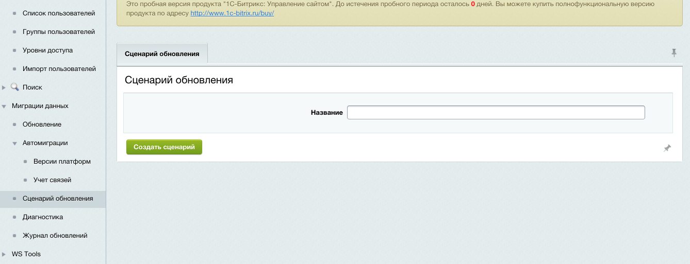
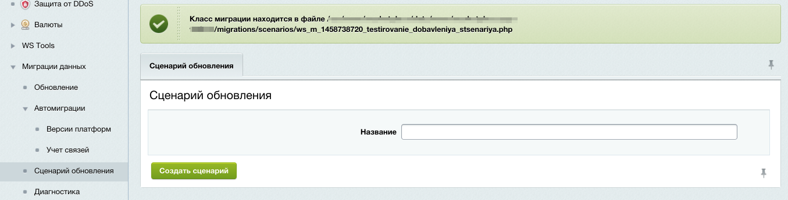
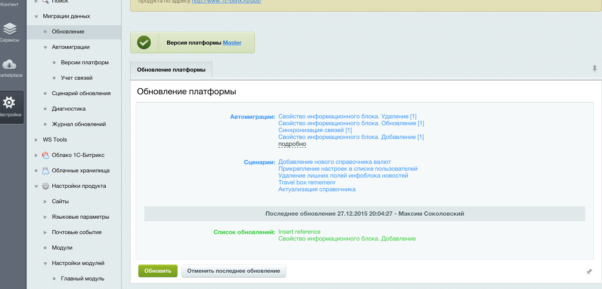

##### [Главная страница](../README.md)

### Работа со скриптами миграций

Часто стандартного функционала автоматических миграций не хватает для поддержки версий (копий) проекта в актуальном состоянии, `модуль миграций` предоставляет
функционал создания "гибкой миграции" путем определения сценария миграции программистом. Также имеется набор классов для быстрого и удобного
создания новых данных.

#### 1. Создание класса сценария миграции

Создание класса сценария осуществляется из меню `Миграции данных -> Сценарий обновления`,
где необходимо ввести название сценария и описание

###### Создание сценария. Ввод названия



Название можно задавать кириллицей. После создания появляется сообщение с информацией о местонахождении файла класса



#### 2. Редактирование. Определение алгоритма исполнения скрипта

По пути, указанному в сообщении находится следующий класс

###### Сценарий. Редактирование класса

```php
<?php

/**
 * Class definition update migrations scenario actions
 **/
class ws_m_1458654949_pervoe_migrirovanie_na_platformu extends \WS\Migrations\ScriptScenario {

    /**
     * Name of scenario
     **/
    static public function name() {
        return "Первое мигрирование на платформу";
    }

    /**
     * Description of scenario
     **/
    static public function description() {
        return "";
    }

    /**
     * @return array First element is hash, second is owner name
     */
    public function version() {
        return array("0b293915ef769882aa400eb10cfa2540", "Master");
    }

    /**
     * Write action by apply scenario. Use method `setData` for save need rollback data
     **/
    public function commit() {
        // my code
    }

    /**
     * Write action by rollback scenario. Use method `getData` for getting commit saved data
     **/
    public function rollback() {
        // my code
    }
}
```


В нем предназначены для модификации два метода:
* `commit` - содержит алгоритм применения миграции
* `rollback` - содержит алгоритм отката миграции

Методы `getData` и `setData` предоставляют доступ к данным и их сохранение соответственно, необходимо для сохранения данных для отката.

В случае, если скрипты миграций работают в тандеме с автоматическими миграциями классу сценария предоставлен доступ к контроллеру ссылок `$this->getReferenceController()` для
регистрации или получения идентификаторов записей согласно версиям копий проекта, он необходим для работы с сущностями, которые также затрагиваются автомиграциями.

#### 3. Применение

Применение сценариев миграций осуществляется через функционал общего применения.

###### Применение сценариев миграций



Данные по сценариям миграций также попадают в журнал изменений. В анализе изменений можно просмотреть промежуточную информацию.

#### Классы для упрощения работы с предметной областью

Для сценариев миграций существуют классы (билдеры) позволяющие гибко и быстро создавать новые сущности данных.

Работа с билдерами строится следующим образом:

```php
<?php

$ibBuilder = new \WS\Migrations\Builder\IblockBuilder();
$ibBuilder->getIblock("Каталог товаров");

$ibBuilder
    ->getSection("Бытовая техника")
    ->setName("Техника для дома");

// сохранение изменений в базу данных
$ibBuilder->commit();
```

Перечень классов:

* \WS\Migrations\Builder\IblockBuilder
* \WS\Migrations\Builder\HighLoadBlockBuilder
* \WS\Migrations\Builder\FormBuilder
* \WS\Migrations\Builder\EventsBuilder
* \WS\Migrations\Builder\AgentBuilder
