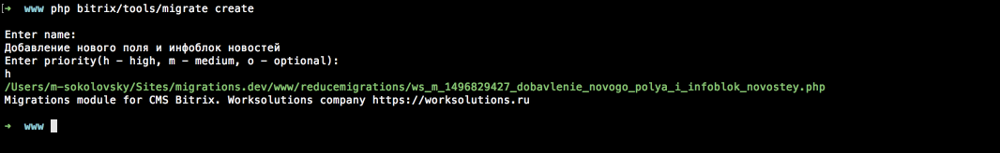

##### [Главная страница](../README.md)

## Работа со скриптами миграций

`Модуль миграций` предоставляет функционал создания "гибкой миграции" путем определения сценария обновления программистом. Также имеется набор классов для быстрого и удобного создания новых данных.

Файлы миграций создаются в виде PHP классов.

### 1. Создание класса сценария миграции

#### Консоль

Один из простых способов создания миграйции – через консоль.



В этом случае необходимо ввести название миграции и приоритет.

Существуют три варианта проритета миграции:
* ```high (h)``` - высокий, сценарии с этим приоритетом обновляются в первую очередь;
* ```middle (m)``` - средний, такие сценарии выполняются сразу после сценариев с высоким приоритетом;
* ```optional (o)``` - опциональный, могут быть пропушены во время обновления;

В любом случае приоритет можно сменить в исходном коде миграции после ее создания.

#### Административный интерфейс

Создание класса сценария осуществляется из меню `Миграции данных -> Сценарий обновления`, где необходимо ввести название сценария, выбрать приоритет миграции и примерное время выполнения.

Примерное время выполнения можно установить непосредственно в исходном коде файла миграции.

##### Создание сценария. Ввод названия


Название можно задавать кириллицей. После создания появляется сообщение с информацией о местонахождении файла класса


### 2. Редактирование. Определение алгоритма исполнения сценария

По пути, указанному в сообщении находится следующий класс:

##### Сценарий. Редактирование класса

```php
<?php

/**
 * Class definition update migrations scenario actions
 **/
class ws_m_1492519399_sozdanie_veb_formy_obratnoy_svyazi extends \WS\ReduceMigrations\Scenario\ScriptScenario {

    /**
     * Name of scenario
     **/
    static public function name() {
        return "Создание веб-формы обратной связи";
    }

    /**
     * Priority of scenario
     **/
    static public function priority() {
         return self::PRIORITY_MEDIUM;
    }

    /**
     * @return string hash
     */
    static public function hash() {
        return "55925bade27806617493ee99588050aca0463073";
    }

    /**
     * @return string is owner name
     */
    static public function owner() {
        return "Igor Pomiluyko";
    }

    /**
     * @return string approximately time (in seconds)
     */
    static public function approximatelyTime() {
        return 10;
    }

    /**
     * Write action by apply scenario. Use method `setData` for save need rollback data
     **/
    public function commit() {
        // my code
    }

    /**
     * Write action by rollback scenario. Use method `getData` for getting commit saved data
     **/
    public function rollback() {
        // my code
    }
}
```


В нем предназначены для модификации два метода:
* `commit` - содержит алгоритм применения миграции;
* `rollback` - содержит алгоритм отката миграции;

Методы `getData` и `setData` предоставляют доступ к данным и их сохранение соответственно, необходимо для сохранения данных для отката. Например после создания формы сохранить ее идентификатор, чтобы в случае отката по этому идентификатору форму удалить.

Метод ```hash``` содержит уникальный ключ миграции. Так ее можно будет различать среди остальных. Это особенно полезно при применениях и откатах.

#### Классы для упрощения работы с предметной областью ```билдеры```

Для сценариев миграций существуют классы (билдеры) позволяющие гибко и быстро создавать новые сущности данных.

Работа с билдерами строится следующим образом:

```php
<?php

$ibBuilder = new \WS\ReduceMigrations\Builder\IblockBuilder();
$ibBuilder->createIblock('type_content', 'Новости', function (\WS\ReduceMigrations\Builder\Entity\Iblock $iblock) {
    $iblock
        ->siteId('s1')
        ->sort(100)
        ->code('news')
        ->groupId(array(
           '2' => 'R'
        ));
    $iblock
        ->addProperty('Выводить на главной')
        ->code('showOnMain')
        ->typeCheckbox()
        ->addEnum('да');
});

```

Перечень классов:

* \WS\ReduceMigrations\Builder\TableBuilder
* \WS\ReduceMigrations\Builder\IblockBuilder
* \WS\ReduceMigrations\Builder\HighLoadBlockBuilder
* \WS\ReduceMigrations\Builder\FormBuilder
* \WS\ReduceMigrations\Builder\EventsBuilder
* \WS\ReduceMigrations\Builder\AgentBuilder
