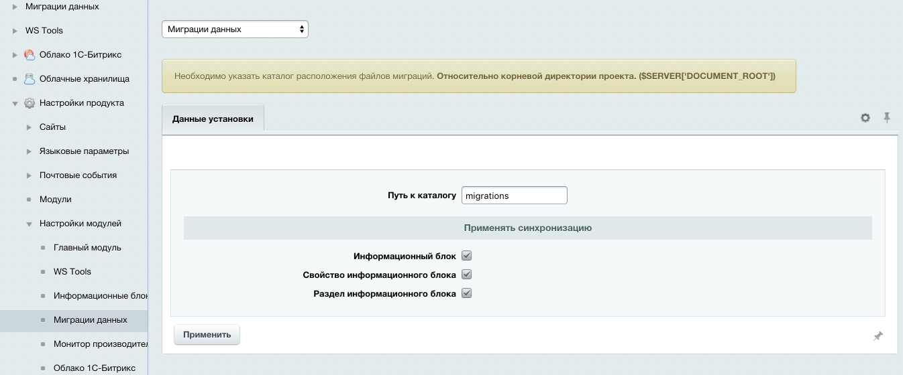
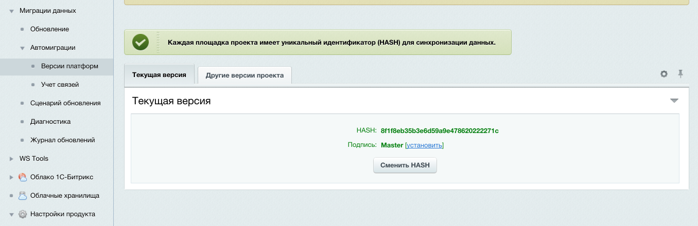

##### [Главная страница](../README.md)

### Установка и настройка

###### Marketplace

[ссылка на модуль](http://marketplace.1c-bitrix.ru/solutions/ws.migrations/)

Для установки в адресную строку сайта, после доменного имени, прописать:

```
/bitrix/admin/update_system_partner.php?addmodule=ws.migrations
```

При установке модуля необходимо определить основные параметры.

Установка и обновление модуля через ```marketplace``` обязательна, т.к. происходят процедуры подготовки базы данных и файлов.

###### Определение параметров при установке модуля

Для успешной работы модуля необходимо определить каталог, где будут создаваться файлы синхронизации данных.
Каталог сделать должен учитываться системой версионирования проекта.
Так же можно определить настройку автоматически синхронизирующихся данных.


###### Настройка модуля

После установки модуля в настройках можно активировать/дективировать учет изменений данных касающихся функционала инфоблоков.
На текущий момент это: Информационный блок, Свойство информационного блока, Раздел информационного блока.
Если оставить эти обработчики неактивными автоматический учет изменения данных производится не будет.
Необходимо учитывать, что если деактивировать обработчики автоматических изменений, то их активация спустя некоторое время приведет
к неутешительным результатам обновления.



##### Версия платформы

Основной необходимостью применения уникальной версии для каждой платформы является использование в CMS числовых данных для идентификации
сущностей и полей инфоблоков. Есть еще символьные коды, но они не являются обязательными поэтому модулю на них полагаться не стоит.
Таким образом каждая платформа (копия) проекта должна обладать собственной версией (HASH). Версия вычисляется при установке модуля,
либо по требованию в административном интерфейсе.
Версия патформы хранится в файле `uploads/ws.migrations/version.dat`. При импорте данных с другой площадки не нужно менять этот файл.


