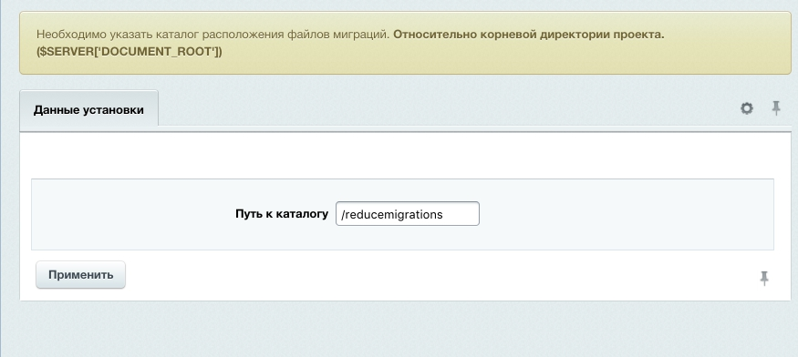

##### [Главная страница](../README.md)

# Установка и настройка

## Composer

Подключение модуля необходимо проводить находясь в DOCUMENT_ROOT проекта:

```
composer require worksolutions/bitrix-reduce-migrations
```
Команда перенесет файлы модуля в папку `/bitrix/modules/ws.reducemigrations`
Следующим шагом будет регистрация в битрикс:

```
composer run-script post-install-cmd -d bitrix/modules/ws.reducemigrations
```
Либо со страницы "Установленные решения":
```
/bitrix/admin/partner_modules.php?lang=ru
```

## Marketplace

[ссылка на модуль](http://marketplace.1c-bitrix.ru/solutions/ws.reducemigrations/)

Для установки в адресную строку сайта, после доменного имени, прописать:

```
/bitrix/admin/update_system_partner.php?addmodule=ws.reducemigrations
```

При установке модуля необходимо определить основные параметры.

### Определение параметров при установке модуля

Для успешной работы модуля необходимо определить каталог, где будут создаваться файлы синхронизации данных.
Каталог сделать должен учитываться системой версионирования проекта.



### Настройка модуля

После установки модуля в настройках можно изменить путь к каталогу, в котором будут храниться миграции


### Владелец платформы

Таким образом каждая платформа (копия) проекта должна обладать собственной версией (HASH). Версия вычисляется при установке модуля,
либо по требованию в административном интерфейсе.
Версия патформы хранится в файле `uploads/ws.reducemigrations/version.dat`. При импорте данных с другой площадки не нужно менять этот файл.


