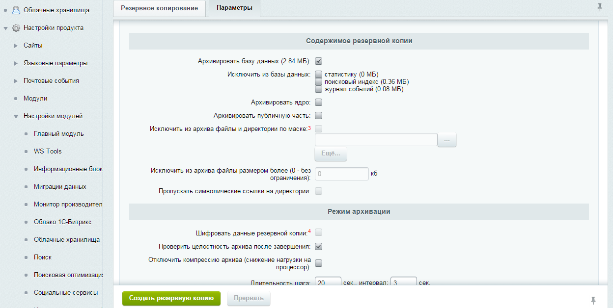

##### [√лавна€ страница](../README.md)

### Ќачало работы

ƒл€ старта успешного применени€ модул€ миграций в проекте необходимо произвести инициализацию начального состо€ни€, котора€
состоит из следующих этапов:

1. ”становить модуль на всех площадках.

2. ќпределить кака€ верси€ (копи€ или площадка) проекта €вл€етс€ наиболее актуальной.
  примеру дл€ проекта, который находитс€ в разработке наиболее актуальной версией €вл€етс€ одна из версий разработчиков, либо демонстрационна€.
¬ проекте, которому обеспечиваетс€ техническа€ поддержка - наоборот, наиболее актуальной можно назвать `production` версию.

3. ѕри помощи функционала резервного копировани€ подготовить копию данных актуальной версии

[ѕодробнее про резервное копирование](http://dev.1c-bitrix.ru/learning/course/index.php?COURSE_ID=35&LESSON_ID=2031)

4. ќбновить данные на другой площадке из созданной резервной копии при помощи скрипта [`restore.php`](http://www.1c-bitrix.ru/download/scripts/restore.php)

“еперь ваша площадка с `модулем миграций` полностью готова к работе.
ѕервоначальное выполнение вышеперечисленных действий в дальнейшем обеспечивает комфорт при разработки проектов.