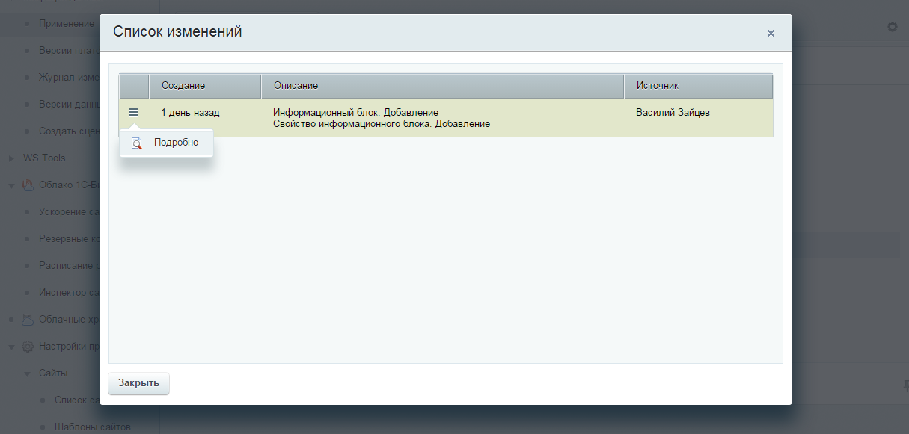
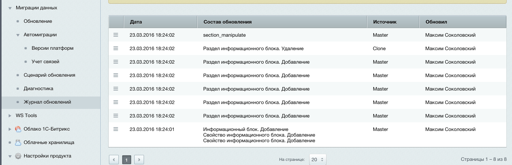

##### [Главная страница](../README.md)

### Обновление площадки

Обновление осуществляется путем анализа файлов фиксаций,
вычисляются новые файловые фиксации (которые не были исполнены для текущей копии проекта),
данные фиксаций передаются обработчикам для обновления. Т.е. получается,  что обработчик который делал снимок, он же этот снимок и востанавливает на текущей БД.

```
При работе с несколькими версиями и созданием новых записей возникает проблема "одновременного"
создания новой записи и рассинхронизация модели данных. Поэтому при создании новых записей данных 
сторонних версий создаются фиксации учета ссылок текущей версии,
которые также необходимо экспортировать (синхронизировать) с файлами каталога миграций. 
```

###### Основной интерфейс обнвления.


###### Интерфейс применения миграций. Просмотр перечня изменений.



###### Подробная информация для анализа изменения


### Отмена уже примененных миграций

Любые изменения фиксаций журналируются. Сохраняются как новые данные, так и снимок, созданный перед применением миграций.
Таким образом существует возможность отката последнего обновления. Так же стоит отметить,
что обновления устанавливаются пакетами и при применении обновлений сохраняется запись о пользователе, установившем обновления вместе с датой обновления.

###### Журнал изменений


